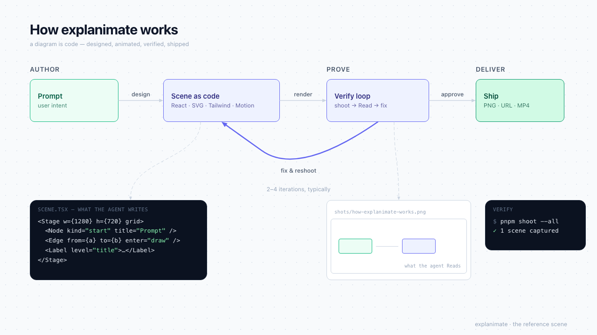

<!-- ABOUTME: Human-facing README — what explanimate is, how to install it as a skill, and how it works. -->
<!-- ABOUTME: The agent-facing entrypoint is SKILL.md; this file is for the person installing the skill. -->

# explanimate

**Explain by animating.** An agent skill that builds animated, React-based visual explainers —
diagram scenes and motion-graphics videos — as real code. The successor to
`excalidraw-diagram-skill`: instead of hand-crafting serialized canvas JSON, the agent writes
React components (SVG + Tailwind), animates them with [Motion](https://motion.dev), verifies them
visually through a screenshot loop, and renders deterministic MP4s with
[Remotion](https://remotion.dev).



## What the agent gets

- **A studio per project** — a Vite + React 19 + TS + Tailwind v4 app scaffolded from
  `templates/studio/`, with a gallery of every scene and video it builds.
- **A primitive vocabulary** — `Stage`, `Node`, `Edge`, `Label`, `Dot`, `Reveal` — semantic,
  animation-agnostic components: Motion drives them in interactive scenes, Remotion's frame clock
  drives them in videos (`appear`/`draw` progress props).
- **A verify loop** — `pnpm shoot <scene-id>` screenshots scenes headlessly; the agent Reads the
  PNG and fixes what it sees. Nothing ships unseen.
- **Video in the browser and to file** — every composition plays instantly in the gallery via
  `@remotion/player`, and `pnpm video:render <id>` produces the MP4.
- **A methodology** — argue-don't-display, the Isomorphism/Education/Motion tests, the pattern
  library, evidence artifacts. See `SKILL.md` and `references/`.

## Install as a skill

```bash
# Claude Code — user scope (all projects):
cp -R explanimate ~/.claude/skills/explanimate

# Claude Code — project scope:
cp -R explanimate <project>/.claude/skills/explanimate

# Or symlink to keep it updatable in place:
ln -s /Users/notpritamm/Documents/skills/explanimate ~/.claude/skills/explanimate
```

Any agent runtime that reads `SKILL.md`-style skills (Codex, custom harnesses) can consume the same
folder — the skill is self-contained: docs + template + scripts, no network access required beyond
`pnpm install`.

## Requirements

Node ≥ 22, pnpm ≥ 9. First studio install runs `pnpm exec playwright install chromium` (cached
machine-wide). Remotion downloads its own headless browser on the first render.

## Repo layout

| Path                | What                                                    |
| ------------------- | ------------------------------------------------------- |
| `SKILL.md`          | Agent entrypoint — methodology, workflow, primitive API |
| `references/`       | Deep dives: design tokens, patterns, motion, video      |
| `templates/studio/` | The scaffold (complete, runnable Vite app)              |
| `scripts/init.mjs`  | Copies the template into a consumer project             |
| `docs/`             | Architecture decisions + append-only build log          |

## Working on the skill itself

`pnpm install` once (husky hooks), then `pnpm validate` before pushing. Conventional commits with
scopes (`commitlint.config.mjs`); every source file carries an ABOUTME header; the build log
protocol is in `docs/build-log/README.md`. Template changes must be re-verified:
`cd templates/studio && pnpm typecheck && pnpm shoot --all` — then look at the PNGs.
